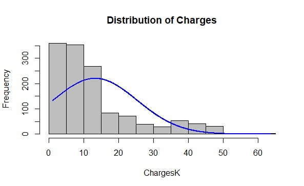
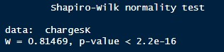
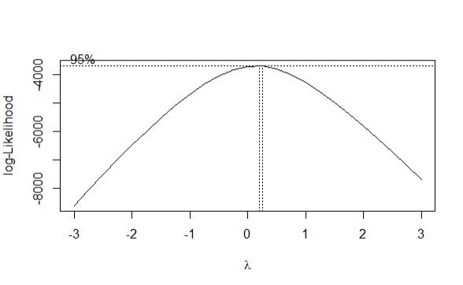
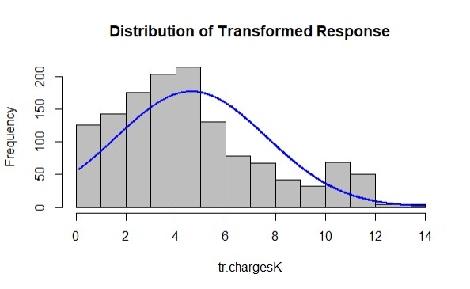
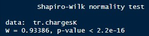
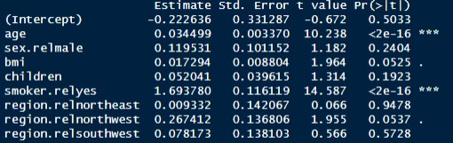

<body>
	<header>
		<h1> Health Insurance Premium Regression Analysis </h1>
	</header>
<body>

	

This project explores health insurance premium charges using regression models, specifically Box-Cox and Gamma Regression, implemented in R and SAS. The goal is to understand the factors influencing premium variations and identify an effective model for the given dataset.
	

	<h2>Background</h2>
	

		Insurance premium refers to the payment made by individuals or businesses for their insurance coverage, whether it's for healthcare, auto, home, or life insurance. When someone signs up for an insurance policy, they are charged a premium by the insurer. This premium is used by the insurer to cover potential costs associated with the policies they offer. Apart from the premium, the total cost of healthcare includes other factors like deductibles, copayments/coinsurance, and expenses for health and drug services. A deductible is the amount an individual pays for covered health services before the insurance company starts covering costs. Copayments and coinsurance are payments made to healthcare providers each time someone receives care. Analytics plays a crucial role in the insurance industry by helping businesses interpret data effectively. These analytic methods often involve using data-mining tools and statistical inference techniques.
	

	<h2>Dataset Information</h2>
	
 The dataset was obtained from <a href="https://www.kaggle.com/datasets/mirichoi0218/insurance">Kaggle</a>, a popular platform for data scientists, containing 1338 rows of data with 7 variables:

<ul>
	<li><b>Age</b>: Age of primary beneficiary
	<li><b>Sex</b>: insurance contractor gender: female or male
	<li><b>BMI</b>: Body mass index
	<li><b>Children</b>: Number of children covered by health insurance / Number of dependents
	<li><b>Smoker</b>: (yes/no)
	<li><b>Region</b>: The beneficiary's residential area in the US (southeast, southwest, northeast, northwest)
	<li><b>Charges</b>: Individual medical costs billed by health insurance
</ul>
The original dataset did not contain any missing or undefined values. For this analysis, the dataset was truncated to the first 100 observations. The response variable chosen was insurance charges, with the other variables serving as predictors.
	

	<h2>Analysis</h2>

After plotting the individual medical costs billed by health insurance, the distribution appears to not be normally distributed as supported by the histogram and the normality tests. Many statistical methods assume that the residuals of the data are normally distributed. Right-skewed data can violate these assumptions, leading to incorrect inferences and results.

 

To test the normality of a distribution, one commonly used method is the Shapiro-Wilk test. The null hypothesis, $H_0$, for this test states that the population from which the sample is drawn follows a normal distribution. The alternative hypothesis, $H_1$, asserts that the population is not normally distributed.

The test statistic for the Shapiro-Wilk test is denoted by $W$ and is calculated based on the sample data. Under the null hypothesis of normality, the test statistic \(W\) follows a specific distribution. The significance level, denoted by $\alpha$, is chosen to assess the strength of evidence against the null hypothesis.

If the p-value associated with the Shapiro-Wilk test is less than the chosen significance level $\alpha$, typically 0.05, then we reject the null hypothesis and conclude that the data do not follow a normal distribution. Conversely, if the p-value is greater than or equal to $\alpha$, we fail to reject the null hypothesis, indicating that there is insufficient evidence to conclude that the data deviate from a normal distribution.

	<h2>Regression Models</h2>
	

Both Box-Cox and Gamma Regression models were applied to model the insurance premium charges.
	

### Box-Cox Power Transformation

If the density of the response variable $y$ is right-skewed, a transformation may be applied to $y$ to make its density appear more normally shaped. This transformation is referred to as *Box-Cox power transformation*. The transformed variable, denoted here by $\tilde{y}$, has the form:

The fitted mean for the Box-Cox transformed response is:

|BoxCox.fit.x | BoxCox.fit.y |
|-------------|--------------|
|0.25         |-3716.47      |

The optimal $\lambda$ was computed to be $0.25$, which prompted for a square root transformation of $2 ( 1 - \frac{1}{\sqrt{y}})$. However, after plotting a histogram to the transformed response and conducting a normality test, the p-value was smaller than 0.05, and the transformed response remained not normally distributed.

### Gamma Regression Model
A gamma regression, alternatively, was fitted to the positive response with a right-skewed distribution. In this model, $y$ has a gamma distribution with the density

0,\quad&space;y>0&space;" />

The fitted mean response has the form:
$\hat{E}(y) = \hat{\alpha}\hat{\beta} = exp(\hat{\beta_0} + \hat{\beta_1}x_1 + ... + \hat{\beta_k}x_k)$, and the estimtated dispersion parameter $\hat{\alpha} = 1/\hat{\phi}$. Thus, in the fitted model, the estimated parameters satisfy $\hat{\alpha} = 1/\hat{\phi}$ and $\hat{\beta} = \hat{\phi}exp(\hat{\beta_0} + \hat{\beta_1}x_1 + ... + \hat{\beta_k}x_k)$.

After fitting the gamma model, significant predictors included age, BMI, smoking, and region northwest.

	<h2>Predictor Interpretation</h2>

The interpretation for significant predictors is as follows:

<ul>
	<li>As age increases by one year, the estimated mean premiums increase by 3.51%.
	<li>An increase of one BMI point corresponds to a 1.745% increase in estimated mean premiums.
	<li>Smokers have estimated mean premiums 5.44% higher than nonsmokers.
	<li>People living in the northwest have estimated mean premiums 1.3066% of those living in the southeast.

	<h2>Conclusion</h2>

The Gamma Regression proved effective in modeling health insurance premium charges, capturing the inherent right-skewness of the dataset. This analysis provided insights into risk underwriting in health insurance, showcasing the interplay of various attributes on insurance premiums.
